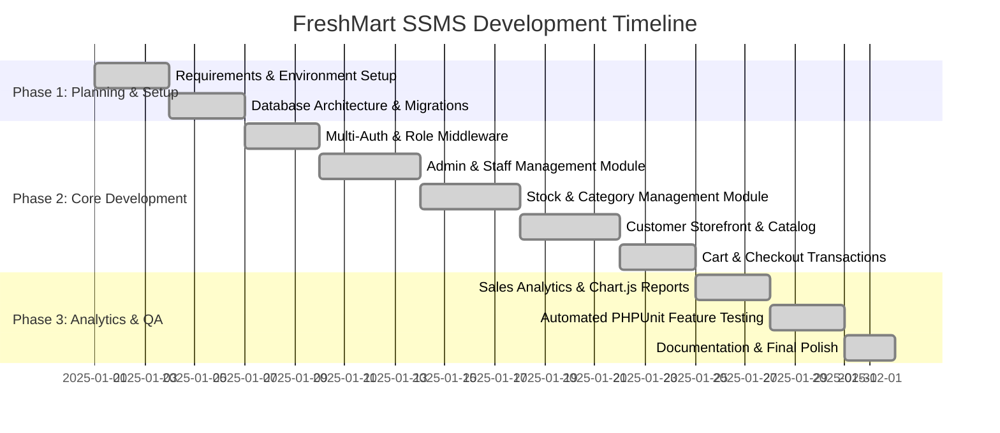

# FreshMart SSMS — Project Plan
**Supermarket & Store Management System**

---

## 1. Project Introduction
The **FreshMart Supermarket & Store Management System (SSMS)** is an end-to-end, enterprise-ready web application built to modernize and automate retail supermarket operations. The system bridges the gap between customer-facing digital grocery shopping and backend inventory, stock replenishment, staff access control, and financial sales reporting.

---

## 2. Background
Traditional physical supermarkets and grocery chains frequently rely on disconnected standalone cash registers or manual inventory ledger books. Stock personnel manually count products, often missing expiring items on shelves, while store owners face discrepancies between actual stock levels and reported sales. With growing demand for digital grocery ordering and omnichannel delivery, modern retail requires a consolidated platform that synchronizes sales, inventory deductions, shelf expiration monitoring, and role-based staff operations in real time.

---

## 3. Problem Statement
Retail stores encounter several operational bottlenecks:
1. **Inventory Discrepancies & Stockouts:** Lack of automated threshold alerts leads to out-of-stock items, causing lost revenue.
2. **Expired Goods & Spoilage Losses:** Perishable items, dairy, juices, and snacks expire unnoticed on supermarket shelves, posing health compliance risks and severe financial loss.
3. **Inefficient Staff Coordination:** Unsegregated roles allow unauthorized personnel to alter administrative records or sensitive financial metrics.
4. **Poor Customer Experience:** Shoppers lack immediate visibility into stock availability, leading to cancelled orders and checkout delays.
5. **Lack of Centralized Sales Analytics:** Store managers struggle to determine top-selling products and categories without cumbersome manual calculations.

---

## 4. Objectives
- **Automate Stock Tracking:** Automatically decrement inventory immediately upon customer checkout using atomic transactions.
- **Enforce Shelf Freshness:** Automatically highlight expired items and warn staff about items expiring within 30 days.
- **Establish Strict Role-Based Access Control (RBAC):** Provide specialized, segregated portals for `ADMIN`, `STOCK`, and `USER` roles.
- **Deliver Modern Omnichannel Shopping:** Provide an intuitive grocery storefront, category filters, session cart, and express checkout with multiple payment methods.
- **Provide Actionable Business Intelligence:** Deliver interactive KPI dashboards and Chart.js daily revenue trends for administrative decision-making.

---

## 5. Scope
### In Scope:
- Customer registration, login, profile management, and order history tracking.
- Product catalog browsing with search, department filtering, stock badges, and detail views.
- Session shopping cart with real-time stock ceiling validations and price calculations.
- Atomic checkout transaction generating sequential order IDs and itemized details.
- Stock Controller portal for category CRUD, product CRUD, and quick inventory adjustments.
- Dedicated Low-Stock (`Qty <= MinStock`) and Expired-Product alerts.
- Administrator portal for staff CRUD, role assignments, financial reports, and order management.

### Out of Scope (Future Phases):
- Direct hardware barcode scanner integration (POS laser drivers).
- Third-party payment gateway live webhooks (e.g. Stripe/PayPal API live production accounts).
- Native iOS/Android mobile applications (current implementation is responsive web).

---

## 6. Target Users & Stakeholders
1. **Supermarket Customers (Shoppers):** Local residents purchasing groceries, pantry goods, drinks, and snacks.
2. **Stock & Inventory Controllers:** Warehouse and floor staff responsible for shelf restocking, receiving supplier shipments, and removing expired perishables.
3. **Supermarket Store Managers / Administrators:** Business owners and executives overseeing staff accounts, pricing, sales metrics, and store policies.
4. **Delivery Riders & Cashiers:** Fulfillment teams fulfilling orders and verifying Cash on Delivery collections.

---

## 7. System Roles
- **ADMIN:** Complete administrative sovereignty over the system, staff accounts, financial analytics, sales records, products, and categories.
- **STOCK:** Restricted management portal dedicated strictly to inventory health, stock quantities, expiry monitoring, product catalog, and categories.
- **USER (Customer):** Public storefront shopper with capabilities to browse, search, add to cart, place orders, and review past receipts.

---

## 8. Feature Summary
| Module | Features |
| :--- | :--- |
| **Authentication** | Customer registration & login, Staff portal login, password hashing, remember tokens, role-based guard redirection. |
| **Storefront** | Banner showcase, department cards, in-stock badge indicators, search bar, sorting by price and name. |
| **Cart & Checkout** | Session cart, stock limit validation, 5% tax computation, Cash on Delivery / Card simulation, invoice generation. |
| **Stock Control** | Product CRUD, Category CRUD, inline quick restock, low-stock notifications, expiration date monitoring. |
| **Admin Analytics** | 7-day revenue trend chart, top 5 selling products, top 5 selling categories, staff account management. |

---

## 9. Technology Stack
- **Backend Framework:** Laravel 12 (PHP 8.2+)
- **Database:** MySQL / MariaDB (InnoDB, foreign keys, ACID transactions)
- **Frontend Engine:** Blade Template Engine, HTML5, Vanilla CSS3
- **UI Framework & Icons:** Bootstrap 5.3.3, Bootstrap Icons 1.11.3
- **Data Visualization:** Chart.js 4.4.3
- **Testing & Quality Assurance:** PHPUnit 11.5, Laravel Feature & Unit Testing

---

## 10. Project Timeline & Milestones

