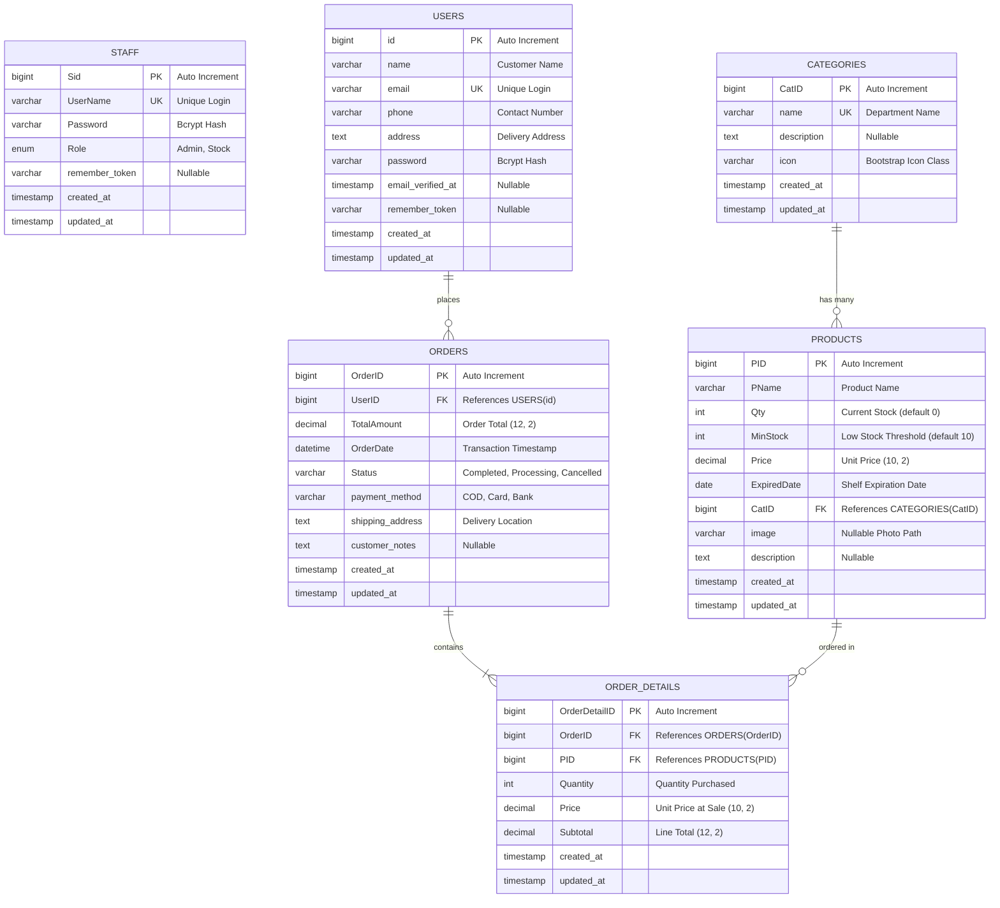

# FreshMart SSMS — Database Design Document

---

## 1. Database Architecture & ERD
The FreshMart database is designed in third normal form (3NF) to eliminate data redundancy while enforcing strict referential integrity across sales, inventory, and user profiles.

### Entity Relationship Diagram (ERD)

---

## 2. Table Specifications & Data Dictionary

### Table 1: `staff`
Stores credentials and access permissions for supermarket administrative and stock control personnel.

| Column | Type | Nullable | Default | Key | Description |
| :--- | :--- | :---: | :---: | :---: | :--- |
| `Sid` | `BIGINT UNSIGNED` | No | Auto Inc | **PK** | Unique Staff Identifier |
| `UserName` | `VARCHAR(255)` | No | None | **UK** | Unique Staff Login Handle |
| `Password` | `VARCHAR(255)` | No | None | — | Bcrypt Hashed Password |
| `Role` | `ENUM('Admin','Stock')` | No | `'Stock'` | — | System Authorization Role |
| `remember_token` | `VARCHAR(100)` | Yes | `NULL` | — | Session Persistence Token |
| `created_at` | `TIMESTAMP` | Yes | `NULL` | — | Record Creation Timestamp |
| `updated_at` | `TIMESTAMP` | Yes | `NULL` | — | Record Update Timestamp |

---

### Table 2: `users`
Stores customer profiles and credentials for public online grocery shopping.

| Column | Type | Nullable | Default | Key | Description |
| :--- | :--- | :---: | :---: | :---: | :--- |
| `id` | `BIGINT UNSIGNED` | No | Auto Inc | **PK** | Unique Customer Identifier |
| `name` | `VARCHAR(255)` | No | None | — | Customer Full Name |
| `email` | `VARCHAR(255)` | No | None | **UK** | Customer Unique Login Email |
| `phone` | `VARCHAR(50)` | Yes | `NULL` | — | Recipient Contact Telephone |
| `address` | `TEXT` | Yes | `NULL` | — | Default Shipping Street Address |
| `password` | `VARCHAR(255)` | No | None | — | Bcrypt Hashed Password |
| `remember_token` | `VARCHAR(100)` | Yes | `NULL` | — | Session Persistence Token |
| `created_at` | `TIMESTAMP` | Yes | `NULL` | — | Account Creation Timestamp |
| `updated_at` | `TIMESTAMP` | Yes | `NULL` | — | Account Update Timestamp |

---

### Table 3: `categories`
Defines grocery departments (e.g. Snacks, Drinks, Milk & Dairy, Bakery, Produce).

| Column | Type | Nullable | Default | Key | Description |
| :--- | :--- | :---: | :---: | :---: | :--- |
| `CatID` | `BIGINT UNSIGNED` | No | Auto Inc | **PK** | Unique Category Identifier |
| `name` | `VARCHAR(255)` | No | None | **UK** | Category / Department Name |
| `description` | `TEXT` | Yes | `NULL` | — | Department Scope & Description |
| `icon` | `VARCHAR(50)` | Yes | `NULL` | — | Bootstrap Icon CSS Class |
| `created_at` | `TIMESTAMP` | Yes | `NULL` | — | Record Creation Timestamp |
| `updated_at` | `TIMESTAMP` | Yes | `NULL` | — | Record Update Timestamp |

---

### Table 4: `products`
Contains all supermarket merchandise, shelf stock quantities, prices, and expiration dates.

| Column | Type | Nullable | Default | Key | Description |
| :--- | :--- | :---: | :---: | :---: | :--- |
| `PID` | `BIGINT UNSIGNED` | No | Auto Inc | **PK** | Unique Product SKU Identifier |
| `PName` | `VARCHAR(255)` | No | None | — | Commercial Product Name |
| `Qty` | `INT` | No | `0` | — | Current Available Stock Count |
| `MinStock` | `INT` | No | `10` | — | Safe Stock Threshold for Low Alert |
| `Price` | `DECIMAL(10,2)` | No | None | — | Standard Selling Price per Unit |
| `ExpiredDate` | `DATE` | Yes | `NULL` | — | Shelf Expiration Date |
| `CatID` | `BIGINT UNSIGNED` | No | None | **FK** | References `categories(CatID)` |
| `image` | `VARCHAR(255)` | Yes | `NULL` | — | Relative File Path to Product Photo |
| `description` | `TEXT` | Yes | `NULL` | — | Product Ingredients / Details |
| `created_at` | `TIMESTAMP` | Yes | `NULL` | — | Record Creation Timestamp |
| `updated_at` | `TIMESTAMP` | Yes | `NULL` | — | Record Update Timestamp |

**Foreign Key Constraint:**
- `FOREIGN KEY (CatID) REFERENCES categories(CatID) ON DELETE CASCADE`

---

### Table 5: `orders`
Represents an executed customer purchase transaction.

| Column | Type | Nullable | Default | Key | Description |
| :--- | :--- | :---: | :---: | :---: | :--- |
| `OrderID` | `BIGINT UNSIGNED` | No | Auto Inc | **PK** | Unique Order Number |
| `UserID` | `BIGINT UNSIGNED` | No | None | **FK** | References `users(id)` |
| `TotalAmount` | `DECIMAL(12,2)` | No | None | — | Grand Total (Items + Tax) |
| `OrderDate` | `DATETIME` | No | None | — | Exact Transaction Timestamp |
| `Status` | `VARCHAR(255)` | No | `'Completed'` | — | Order Status |
| `payment_method`| `VARCHAR(255)` | No | `'Cash on Delivery'`| — | Payment Type Selected |
| `shipping_address`| `TEXT` | Yes | `NULL` | — | Delivery Destination Address |
| `customer_notes` | `TEXT` | Yes | `NULL` | — | Delivery Instructions |
| `created_at` | `TIMESTAMP` | Yes | `NULL` | — | Record Creation Timestamp |
| `updated_at` | `TIMESTAMP` | Yes | `NULL` | — | Record Update Timestamp |

**Foreign Key Constraint:**
- `FOREIGN KEY (UserID) REFERENCES users(id) ON DELETE CASCADE`

---

### Table 6: `order_details`
Itemized line items within each customer order.

| Column | Type | Nullable | Default | Key | Description |
| :--- | :--- | :---: | :---: | :---: | :--- |
| `OrderDetailID`| `BIGINT UNSIGNED` | No | Auto Inc | **PK** | Unique Line Item Identifier |
| `OrderID` | `BIGINT UNSIGNED` | No | None | **FK** | References `orders(OrderID)` |
| `PID` | `BIGINT UNSIGNED` | No | None | **FK** | References `products(PID)` |
| `Quantity` | `INT` | No | None | — | Units Purchased |
| `Price` | `DECIMAL(10,2)` | No | None | — | Unit Price Locked at Purchase |
| `Subtotal` | `DECIMAL(12,2)` | No | None | — | Line Item Subtotal (`Qty * Price`)|
| `created_at` | `TIMESTAMP` | Yes | `NULL` | — | Record Creation Timestamp |
| `updated_at` | `TIMESTAMP` | Yes | `NULL` | — | Record Update Timestamp |

**Foreign Key Constraints:**
- `FOREIGN KEY (OrderID) REFERENCES orders(OrderID) ON DELETE CASCADE`
- `FOREIGN KEY (PID) REFERENCES products(PID) ON DELETE CASCADE`

---

## 3. Relational Integrity & Business Logic Rules
1. **Low Stock Detection:** Computed via dynamic Eloquent scope:
   $$\text{isLowStock} \iff \text{Qty} \le \text{MinStock} \land \text{Qty} > 0$$
2. **Expired Product Detection:** Computed dynamically:
   $$\text{isExpired} \iff \text{ExpiredDate} \le \text{CURRENT\_DATE}()$$
3. **Expiring Soon Detection (30 Days):**
   $$\text{isExpiringSoon} \iff \text{CURRENT\_DATE}() < \text{ExpiredDate} \le \text{CURRENT\_DATE}() + 30\text{ days}$$
4. **Stock Decrement Rule:** During checkout transaction, an atomic decrement is executed:
   $$\text{Product}.\text{Qty} \leftarrow \text{Product}.\text{Qty} - \text{OrderDetail}.\text{Quantity}$$
   Guaranteed by `Product::lockForUpdate()` within `DB::transaction()`.
